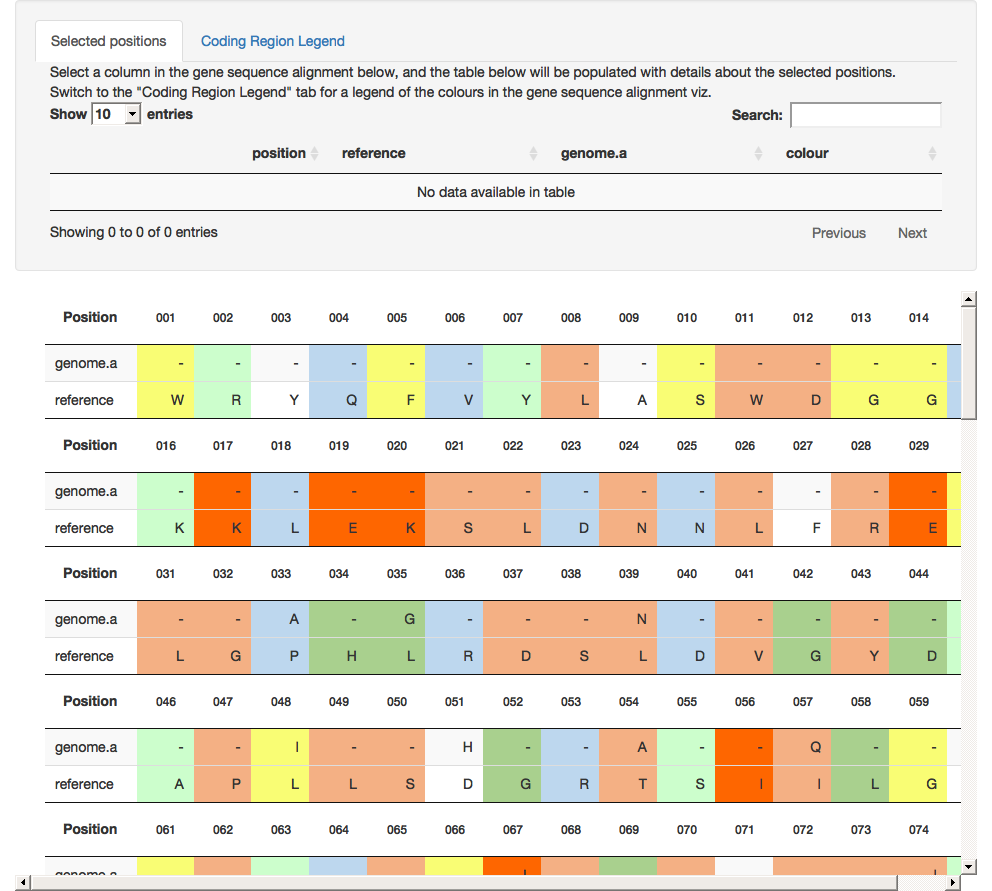

<!-- README.md is generated from README.Rmd. Please edit that file -->
gene.alignment.tables
=====================

This package allows for interactive gene sequence alignment visualisations to be embedded into Shiny apps. An example Shiny app is provided in this package and available using `runExample`, please note that at present the output will only work within a Shiny app - future support to output as a htmlwidget might be possible...

``` r
runExample()
```



Installation
------------

You can install gene.alignment.tables from github with:

``` r
# install.packages("devtools")
devtools::install_github("charliejhadley/gene.alignment.tables")
```

It's unlikely this package will live on CRAN, if it ever does there will be significant changes to the packages before deployment.

Example
-------

The package comes with two example datasets, both of these are based on real research datasets but anonymised (for the time being).

``` r
# library("gene.alignment.tables")
str(hbv_long_s_sequence)
#> Classes 'tbl_df', 'tbl' and 'data.frame':    300 obs. of  4 variables:
#>  $ position : int  1 2 3 4 5 6 7 8 9 10 ...
#>  $ reference: chr  "W" "R" "Y" "Q" ...
#>  $ genome.a : chr  "-" "-" "-" "-" ...
#>  $ colour   : chr  "#f9fd74" "#ccfecc" NA "#bdd7ee" ...
str(hbv_pol_sequence)
#> Classes 'tbl_df', 'tbl' and 'data.frame':    843 obs. of  4 variables:
#>  $ position : int  1 2 3 4 5 6 7 8 9 10 ...
#>  $ reference: chr  "S" "C" "E" "S" ...
#>  $ genome.a : chr  "-" "-" "-" "-" ...
#>  $ colour   : chr  "#f4b084" "#bdd7ee" "#f4b084" "#fe6600" ...
```

To use visualise your own data you must have the following columns, any other columns will be displayed in the gene.tables.alignment viz.

| position |   colour   |
|:--------:|:----------:|
|     1    | "\#f9fd74" |
|     2    | "\#f9fd74" |

You must also ensure to create the following observer and `reactiveValues` object in your `server.R` file:

``` r
selected_col_values <- reactiveValues()
  
  observe({
    if (!is.null(input[[paste0(alignment.dt.unique.id,
                               "_1_",
                               table_width,
                               "_rows_current")]])) {
      selected_col_values[["previous"]] <-
        isolate(selected_col_values[["current"]])
      
      all_inputs <- isolate(reactiveValuesToList(input))
      
      inputs_selected_cols <-
        grepl(
          paste0(
            alignment.dt.unique.id,
            "_[0-9]{1,}_[0-9]{1,}_columns_selected"
          ),
          names(all_inputs)
        )

      inputs_with_nulls <- all_inputs[inputs_selected_cols]
      
      inputs_selected_cols <-
        setNames(inputs_with_nulls, names(all_inputs)[inputs_selected_cols])

      selected_positions <-
        lapply(names(inputs_selected_cols), function(id) {
          id_to_sequence_position(id, shiny.input = input)
        }) %>%
        unlist()

      selected_positions
      

    } else {
      if (is.null(selected_col_values[["current"]])){
        selected_positions <- NULL
      }
      else {
        selected_positions <- selected_col_values[["current"]]
      }
    }
    
    selected_col_values[["current"]] <- selected_positions
  })
```

The selection of the sequence elements can be watched as follows:

``` r
selected_positions <- selected_col_values[["current"]] %>%
      sort()
```
